# db_tool 架构设计 UML 文档

> 生成时间：2026-07-29  
> 项目：ztool/ai_cli  
> 工具：db_tool —— 数据库操作 CLI 工具

---

## 目录

1. [一、框架设计 UML](#一框架设计-uml)
   - [1.1 系统上下文图](#11-系统上下文图)
   - [1.2 分层架构图](#12-分层架构图)
   - [1.3 模块依赖图](#13-模块依赖图)
   - [1.4 部署架构图](#14-部署架构图)
2. [二、细节设计 UML](#二细节设计-uml)
   - [2.1 核心类图](#21-核心类图)
   - [2.2 CLI 命令解析类图](#22-cli-命令解析类图)
   - [2.3 配置体系类图](#23-配置体系类图)
   - [2.4 数据类型类图](#24-数据类型类图)
   - [2.5 错误体系类图](#25-错误体系类图)
   - [2.6 query 命令时序图](#26-query-命令时序图)
   - [2.7 execute 命令时序图](#27-execute-命令时序图)
   - [2.8 struct 命令时序图](#28-struct-命令时序图)
   - [2.9 连接建立活动图](#29-连接建立活动图)
   - [2.10 状态机图](#210-状态机图)

---

## 一、框架设计 UML

### 1.1 系统上下文图

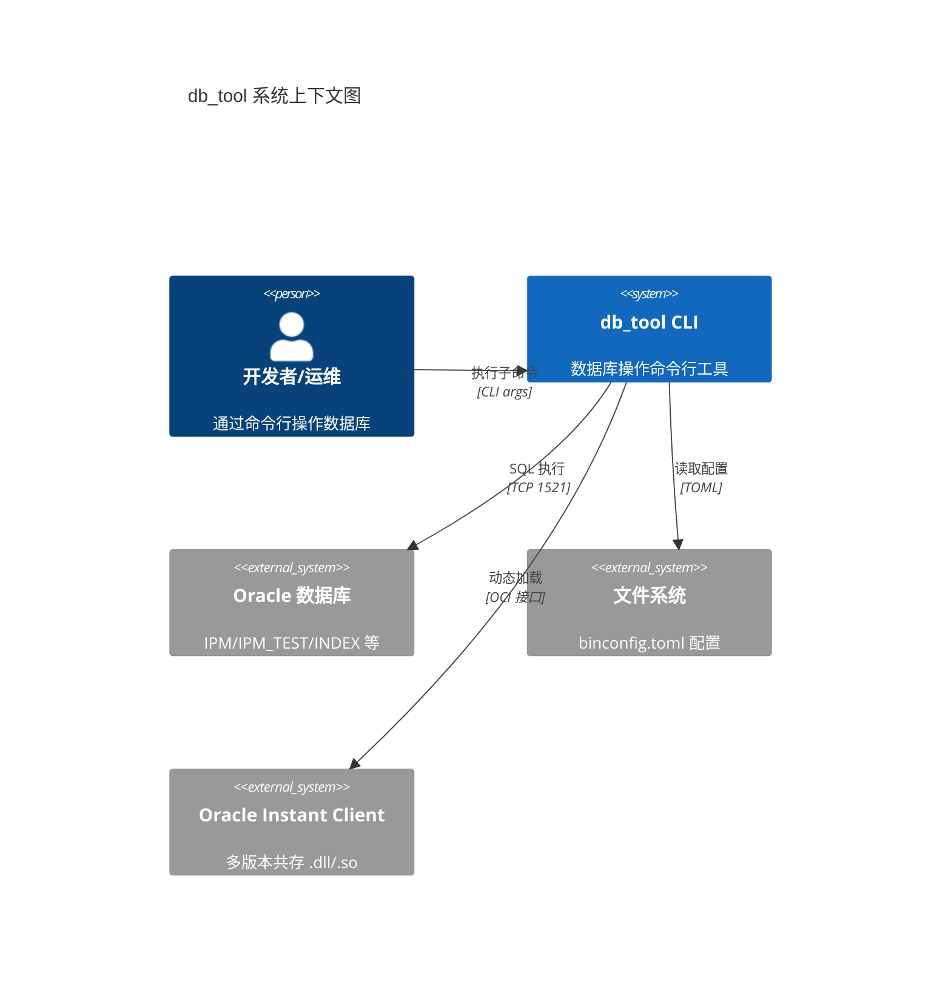

### 1.2 分层架构图

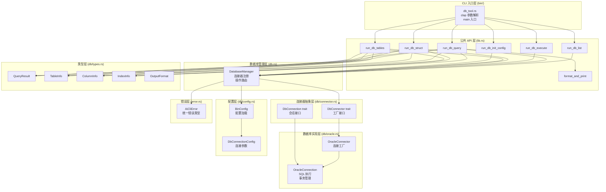

### 1.3 模块依赖图

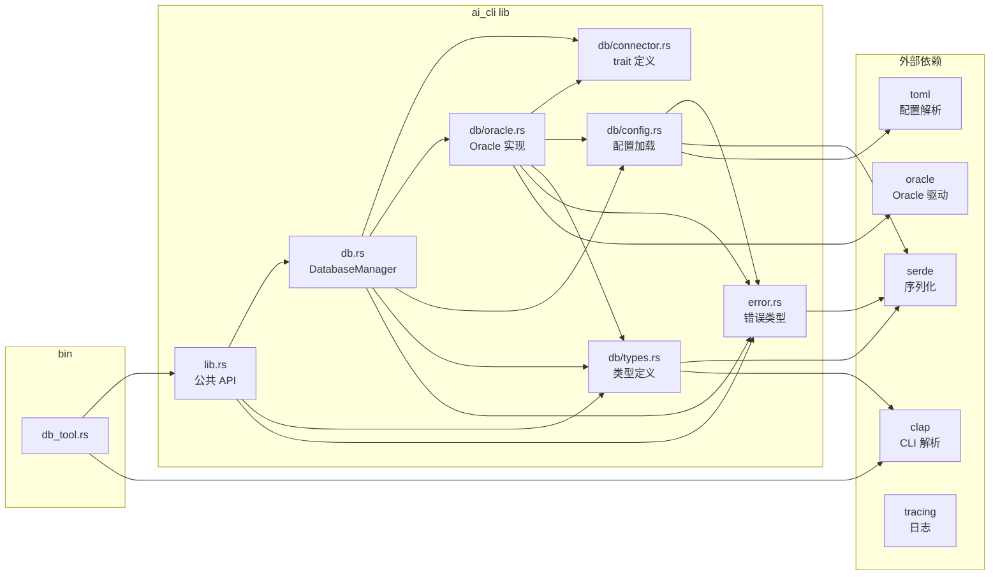

### 1.4 部署架构图

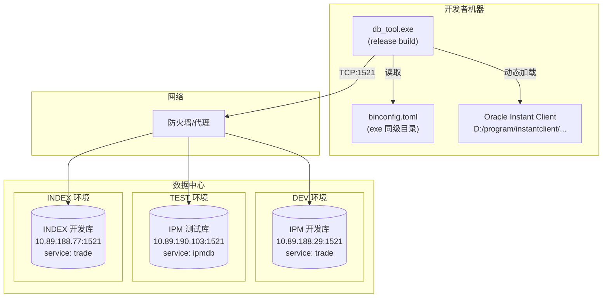

---

## 二、细节设计 UML

### 2.1 核心类图

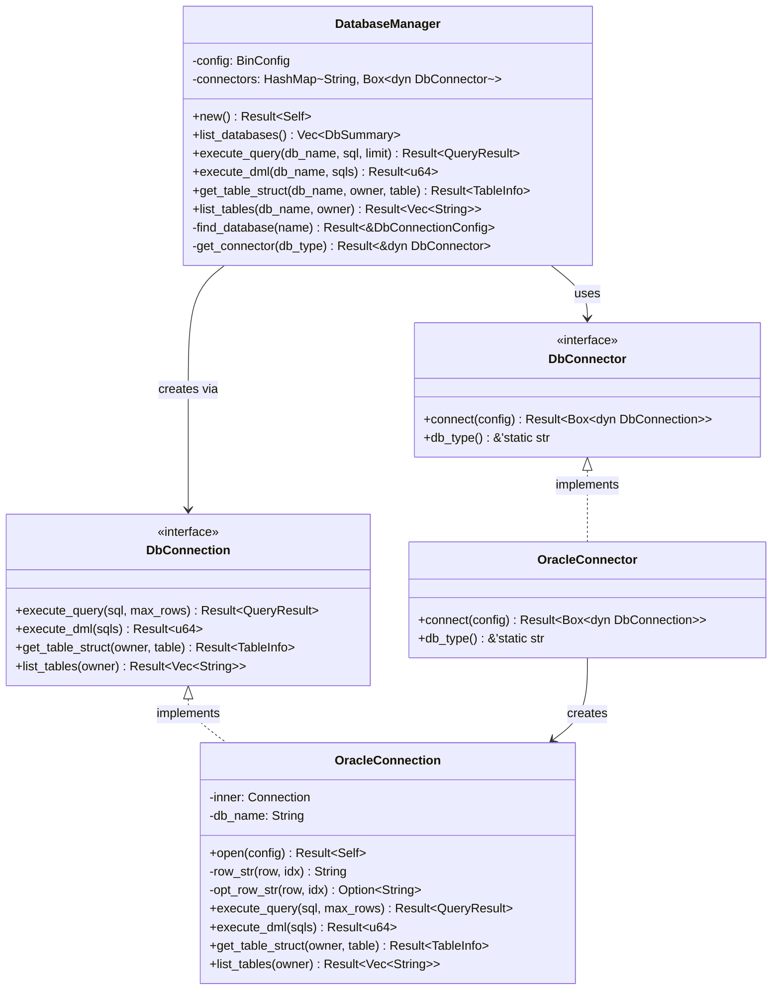

### 2.2 CLI 命令解析类图

```mermaid
classDiagram
    class DbToolCli {
        +format: OutputFormat
        +command: Commands
    }

    class Commands {
        <<enumeration>>
        List
        Query { db_name, sql, limit }
        Execute { db_name, sql }
        TableStruct { db_name, table, owner }
        Tables { db_name, owner }
        Init
    }

    class OutputFormat {
        <<enumeration>>
        Json
        Csv
        Table
    }

    DbToolCli --> Commands
    DbToolCli --> OutputFormat

    note for Commands "Query: -n/--limit 默认100\nExecute: --sql 可多次指定\nTableStruct: owner 默认空→当前用户\nTables: owner 可选"
```

### 2.3 配置体系类图

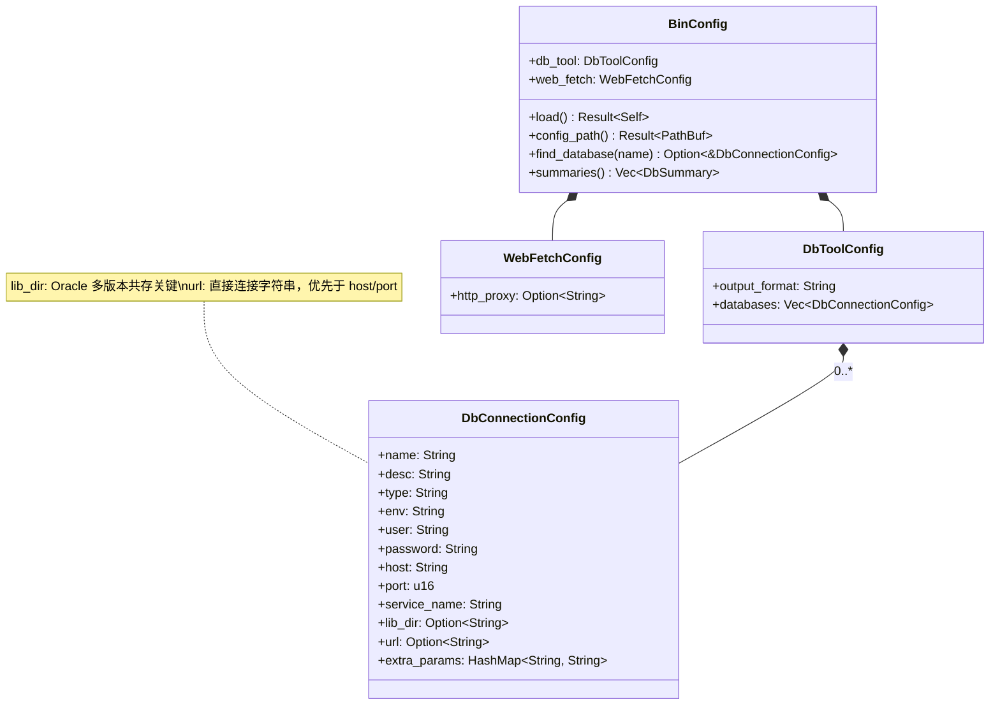

### 2.4 数据类型类图

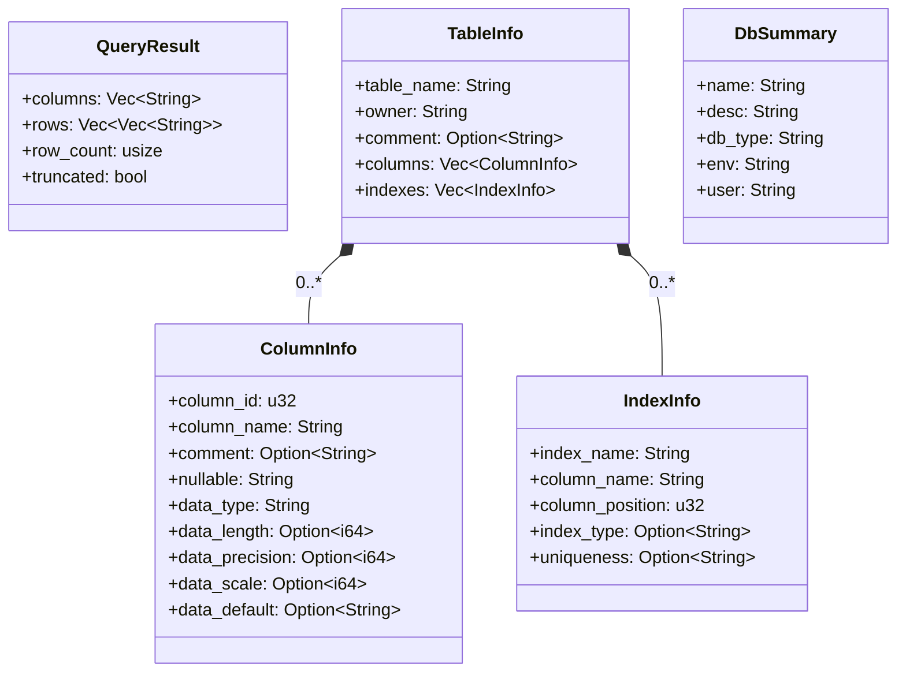

### 2.5 错误体系类图

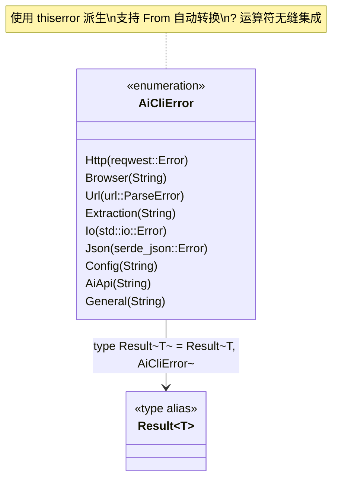

### 2.6 query 命令时序图

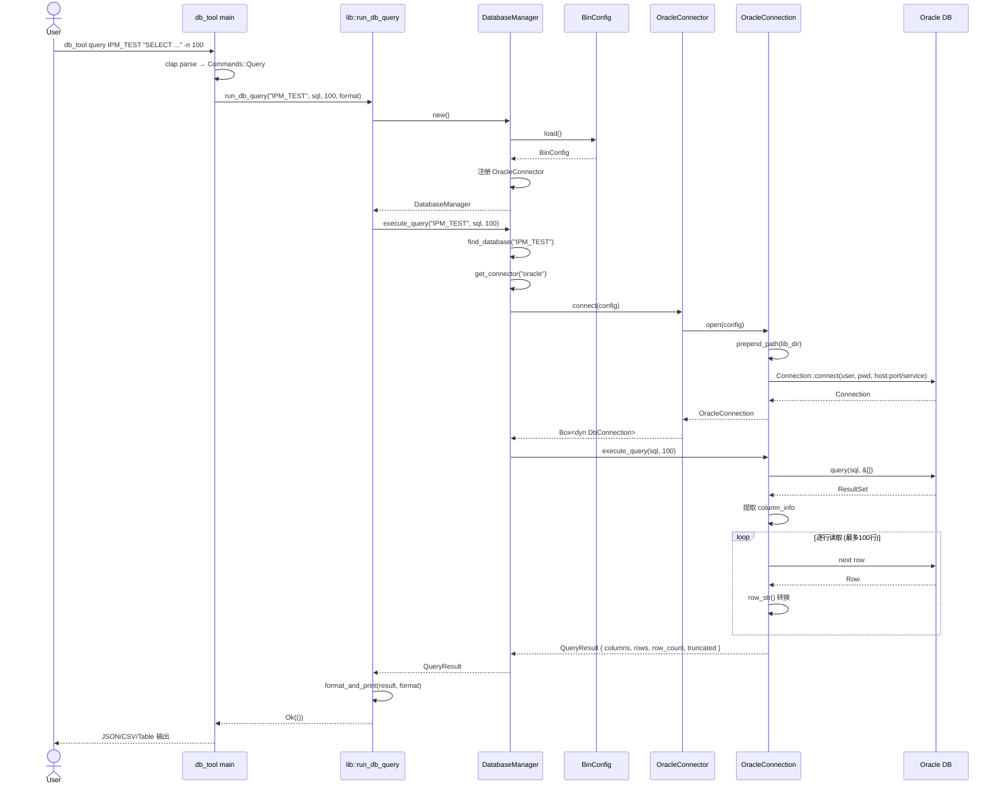

### 2.7 execute 命令时序图

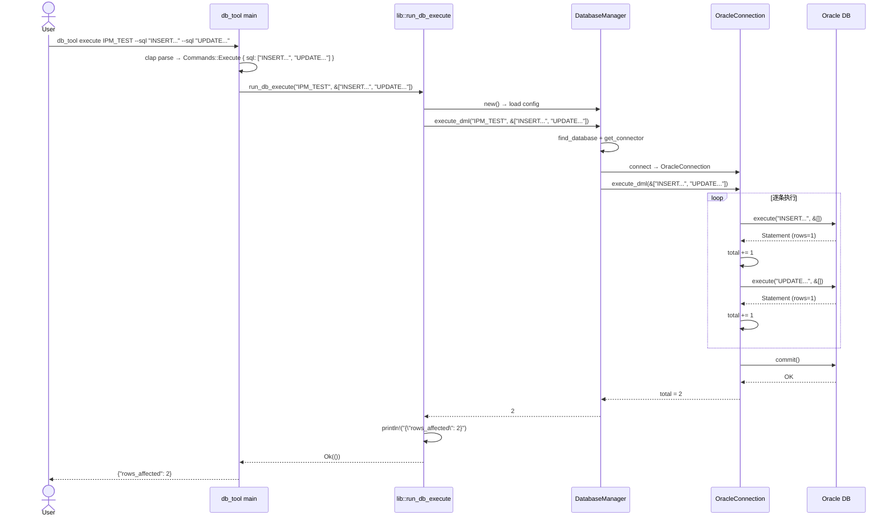

### 2.8 struct 命令时序图

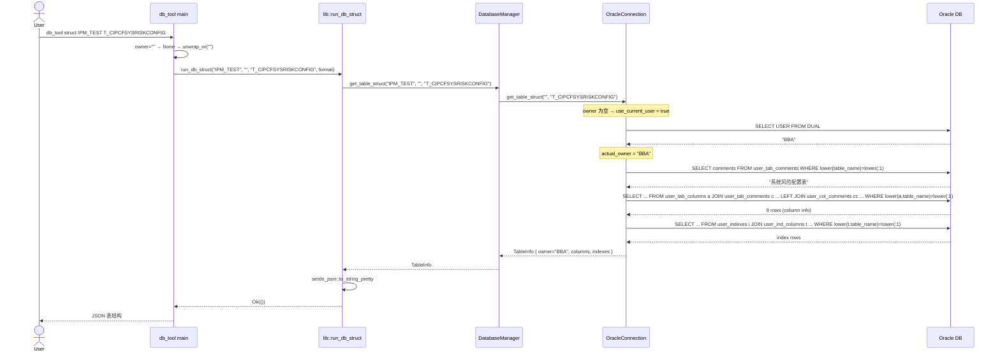

### 2.9 连接建立活动图

```mermaid
stateDiagram-v2
    [*] --> 加载配置: DatabaseManager::new()
    加载配置 --> 检查配置文件: BinConfig::load()

    检查配置文件 --> 文件不存在: config_path 不存在
    检查配置文件 --> 解析TOML: 文件存在
    文件不存在 --> [*]: Err(Config)

    解析TOML --> 注册连接器: toml::from_str

    注册连接器 --> 就绪: connectors.insert("oracle", OracleConnector)

    就绪 --> 查找数据库: execute_* 调用
    查找数据库 --> 数据库不存在: find_database 失败
    查找数据库 --> 获取连接器: 找到配置
    数据库不存在 --> [*]: Err(Config)

    获取连接器 --> 类型不支持: get_connector 失败
    获取连接器 --> 创建连接: connector.connect(config)
    类型不支持 --> [*]: Err(Config)

    创建连接 --> 设置PATH: lib_dir 存在
    创建连接 --> 构建连接串: lib_dir 不存在
    设置PATH --> 构建连接串: prepend_path

    构建连接串 --> URL直连: url 字段非空
    构建连接串 --> host拼接: url 为空
    URL直连 --> 连接Oracle
    host拼接 --> 连接Oracle: "host:port/service_name"

    连接Oracle --> 连接失败: Connection::connect 失败
    连接Oracle --> 连接成功: OracleConnection 创建
    连接失败 --> [*]: Err(Config)
    连接成功 --> [*]: Box<dyn DbConnection>
```

### 2.10 状态机图

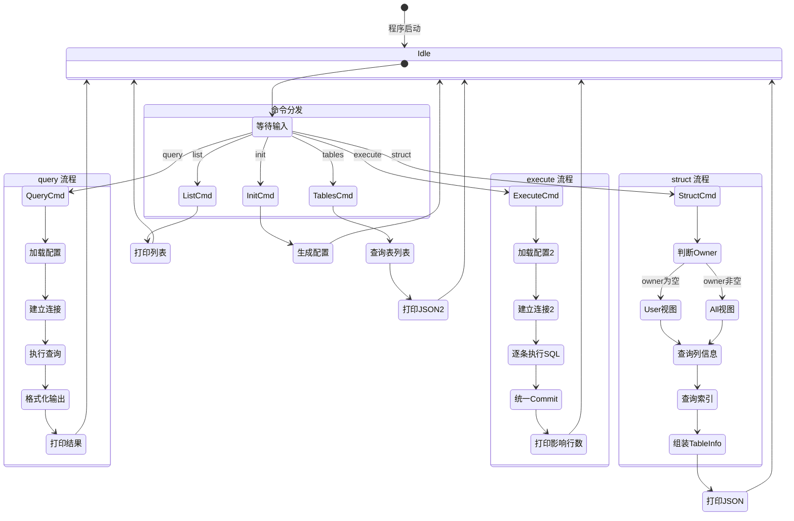

---

## 附录：关键设计决策

| 决策                     | 原因                                           |
| ---------------------- | -------------------------------------------- |
| 每次操作新建连接，不用连接池         | Oracle 多版本共存需要动态切换 PATH，连接池难以管理              |
| owner 为空时用 `user_*` 视图 | `all_*` 视图 + `lower(owner)=lower('')` 永远匹配不到 |
| execute 统一事务 commit    | 批量 DML 需要原子性，避免部分成功                          |
| `--sql` 多值传参           | 比 JSON 数组更自然，shell 直接传参                      |
| `-n` 默认 100 行          | 防止大数据量表撑爆终端                                  |
| `lib_dir` 配置项          | 支持同一机器多个 Oracle 版本共存                         |
| trait 抽象连接器            | 为未来 MySQL/PostgreSQL 扩展预留接口                  |
